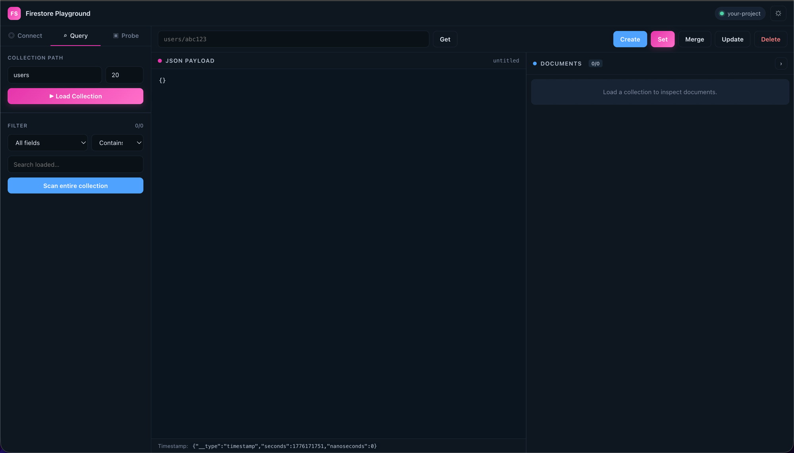

# Firestore Playground

> A GraphQL-Playground–style GUI for Google Cloud Firestore. Browse collections, search documents, probe readable paths, and run CRUD operations — all in the browser, no code required.

<p align="center">
  
</p>

<p align="center">
  <a href="#features">Features</a> ·
  <a href="#getting-started">Getting started</a> ·
  <a href="#usage">Usage</a> ·
  <a href="#tech-stack">Tech stack</a> ·
  <a href="#security-notes">Security notes</a>
</p>

---

## Why

The Firebase Console is great, but it's tied to Google accounts with project access. Sometimes you just want a lightweight client to inspect and mutate Firestore data with your own web config — for debugging, for sharing an auditing view with a collaborator, or for testing security rules from a browser context.

Firestore Playground gives you that, in a UI inspired by GraphQL Playground / GraphiQL: a left-hand sidebar with tabs, a JSON editor on the main panel, and a documents list on the right.

## Features

- **Bring-your-own config** — paste any Firebase web config object (relaxed JSON accepted; unquoted keys OK)
- **Collection browser** — load a sample with a configurable limit, auto-detects available field paths
- **Field search** — filter loaded documents by any field (`contains`, `equals`, `startsWith`) or across all fields
- **Full-collection scan** — pages through the entire collection to find matches beyond the sample limit
- **Collection probe with whitelist** — tests ~140 common collection names (users, orders, posts, sessions…) to discover what the current security rules let you read
- **Discovered-collection picker** — after a probe, found collections appear as chips + datalist in the Query tab (still type-your-own)
- **JSON document editor** — read-modify-write with Timestamp helper (`{"__type":"timestamp","seconds":…}`)
- **Full CRUD** — Create (auto-ID), Set (overwrite), Merge, Update (partial), Delete — with confirmation prompts on destructive actions
- **Responsive** — sidebar collapses to a drawer on mobile, split panels stack
- **Light & dark themes** — persisted to `localStorage`
- **Animated home background** — connected particles with cursor interaction on the setup screen

## Getting started

```bash
npm install
npm start
```

Open <http://localhost:3000>, paste your Firebase web config, click **Connect**.

To build for production:

```bash
npm run build
```

## Usage

### 1. Connect

Paste the Firebase web config object from your project:

```js
{
  apiKey: "YOUR_API_KEY",
  authDomain: "your-project.firebaseapp.com",
  projectId: "your-project",
  // ...
}
```

Both pure JSON and JS-style objects (unquoted keys, trailing commas) are accepted.

### 2. Query tab

- **Collection path** — enter a path like `users`, pick one from the found chips, or use the datalist dropdown
- **Limit** — how many docs to pull for preview
- **Filter** — search within the loaded sample by field or across all fields
- **Scan entire collection** — pages through the whole collection so searches aren't capped by the sample limit

### 3. Probe tab

- Drops in a whitelist of ~140 common collection names by default
- Adds a list of candidate doc IDs (`admin`, `test`, `demo`, …) to try when a collection query returns empty
- Runs each candidate; sorts results with `confirmed` → `readable` → `blocked`
- Click a confirmed path to open it in the editor

### 4. Editor

- Path input accepts `collection/docId` or nested paths
- **Get** loads the document
- **Create** writes a new doc with an auto ID in the current collection (with confirm)
- **Set** overwrites the entire document
- **Merge** writes only the fields in the payload, keeps the rest
- **Update** same as Merge but errors if the doc doesn't exist (useful to prevent accidental creation)
- **Delete** with confirm

## Tech stack

- React 16
- Firebase Web SDK v9 (modular)
- Plain CSS (no framework) with CSS variables for theming
- Canvas-based particle animation on the setup screen (no deps)

## Security notes

Everything runs client-side. The app only talks to Firebase from your browser — there's no intermediate server.

That also means:

- Whatever your Firestore security rules allow reading or writing, this app can do
- API keys in a Firebase web config are **public by design** and not secrets — but they still identify your project, so protect with strong security rules and App Check
- If you're pasting a config that belongs to a teammate or a production project, double-check you have authorization

## Files of interest

- `src/App.js` — all UI + Firestore logic
- `src/firebase.js` — Firebase initialization and re-exports
- `src/ParticlesBackground.js` — canvas particle animation
- `public/index.html` — SEO meta, Open Graph, Twitter cards, JSON-LD

## License

MIT
